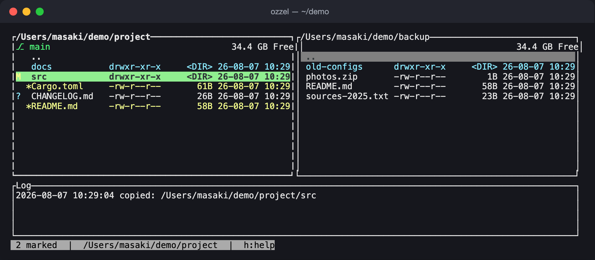

# ozzel

[English](README.md) | 日本語

`ozzel` は Rust で書かれた TUI（テキストユーザーインターフェース）ファイラーです。左右のペインに 2 つのディレクトリを並べて表示し、単一キーのコマンドでファイルのコピー・移動・削除・zip 圧縮・展開を行えます。macOS・Linux・Windows のクロスプラットフォームで動作します。



## 概要

- 2 ペインのディレクトリブラウザ（`Tab` でペイン切り替え、`Enter` で開く、`Backspace` で親ディレクトリへ）
- コピー・移動・削除・リネーム・mkdir・ソート切り替え・隠しファイル表示切り替えなどを単一キーで実行
- コピーと移動は（削除と同様に）実行前に確認ダイアログを表示（設定で無効化可能。ただし上書き衝突時は設定に関わらず常に確認）
- TOML 設定ファイルによるキーバインドの完全な再割り当て（`[keys]`: キー → アクション、`[bindings]`: アクション → キー配列、の両方に対応）。サンプル設定にはデフォルトのキーバインドがすべて `[bindings]` に書き出されており、そのまま編集できます
- 現在有効なキーバインドを表示するヘルプ画面（`h` / `?`）
- 設定ファイルをその場で編集して即座に反映するショートカット（`,`。ファイルが未作成ならテンプレートから新規作成し、保存後は再起動なしで設定を再読み込み）
- 複数ファイルのマーク（`Space`）とマークしたファイルへの一括操作
- インクリメンタルなフィルタ／検索（部分一致、または `re:` プレフィックスで正規表現）
- プレフィックスジャンプ（`\`）— リストを絞り込まずに、前方一致でカーソルだけを移動させるインクリメンタル検索。`Down`/`Up` で次／前のマッチへ移動（端で折り返し）
- コピー・移動・削除・zip 圧縮／展開・仮想ディレクトリからの展開は、すべてバックグラウンドスレッドで非同期に実行され、プログレスバーを表示しながら他の操作を継続できます
- ログペインの各行に記録時刻を表示（長いメッセージは折り返され、継続行はタイムスタンプ幅だけインデントされて桁が揃います）。`L` を押すとログ全体を表示する全画面ログビューアが開きます
- zip の圧縮／展開（zip-slip 対策済み）
- アーカイブ（`.zip`、`.tar`、`.tar.gz`/`.tgz`、`.tar.bz2`/`.tbz2`、`.tar.xz`/`.txz`、および単体の `.gz`/`.bz2` を 1 エントリのアーカイブとして扱う）を展開せずにディレクトリのように閲覧・移動・部分展開できる仮想ディレクトリ機能。パスワード付き zip にも対応（内容を最初に読むタイミングでマスク入力のプロンプトが表示され、そのセッション中は記憶されます）
- 拡張子ごとに設定できる外部ビューアコマンド（`[viewers]`）。設定のない拡張子は組み込みビューアにフォールバックします
- 永続的なディレクトリ履歴とブックマーク、およびペインごとの一時的な戻る／進む履歴（`Shift+←`/`Shift+→`）
- 組み込みビューア（`Enter`/`o` でファイルを開く。日本語テキストの表示に対応。`Tab` でテキスト表示と `xxd` 風の 16 進ダンプを切り替え）。`less` 互換のスクロール（`j`/`k`/`d`/`u`/`f`/`b`/`Space`）と検索（`/`、`?`、`n`、`N`。正規表現を優先し、無効なら部分一致にフォールバック。マッチ箇所をハイライト）に対応
- `:` による外部コマンドの実行と `e` によるエディタの起動（どちらも TUI を一時的に中断）
- コマンドパレット（`F`）— 任意のアクションを名前でインクリメンタルに絞り込んで実行
- `ps` ベースのプロセスマネージャ（`P`、unix のみ）— 2 秒ごとに自動更新される全画面のプロセス一覧。任意の列でソートでき、カーソル位置のプロセスに `SIGTERM`/`SIGKILL` を送れます（常に確認あり）
- raspi-config 風の設定画面（`S`）— カテゴリ → 項目 → 編集の 3 階層からなる全画面 UI で、動作・色・起動時の連携・拡張子ビューア・キーバインド（追加／削除と衝突検出）を設定ファイルを直接編集せずに変更できます。編集は即座に保存・反映され、既存の設定ファイルのコメントを含むレイアウトは保持されます
- カーソルの色（アクティブ／非アクティブの両方）と、ディレクトリ・隠しファイル・実行可能ファイルの行の色は、すべて設定でカスタマイズできます（色名または `#RRGGBB`）
- 非アクティブなペインは暗く表示されます（設定で無効化可能）
- エントリ一覧にパーミッション列を表示（unix: `drwxr-xr-x` 形式、Windows: 簡易表示。設定で無効化可能。ペインが狭すぎる場合は自動的に非表示）
- ファイル／ディレクトリの絶対パスをクリップボードにコピー（`y`。`Y` はペイン自身のディレクトリ）、およびカーソル位置のエントリを同じディレクトリ内に複製（`c`）
- マウス対応（クリックでフォーカス／カーソル移動、ホイールスクロール、ドラッグで範囲のマーク切り替え、ダブルクリックで開く。設定で無効化可能）
- 終了時にフォーカスされていたペインのディレクトリをファイルに書き出し、シェルの `cd` を追随させる仕組み（`--cwd-file`）
- 日本語ファイル名を含む全角文字の表示幅を正しく計算した描画
- `ozzel update` による GitHub 上の最新版への自己更新（内部で `cargo install --git` を実行。`cargo` が必要。リポジトリが公開されて初めて動作します）
- ディレクトリを指すシンボリックリンクは、移動と表示についてはディレクトリと同じに扱われます（`Enter` で潜れる、`<DIR>` 表示、ディレクトリの色）。一方、コピー・移動・削除・複製・zip 圧縮はリンク自体のみを対象とし、リンク先を辿りません — これは意図的な非対称設計です（詳細は後述）

## インストール

Rust ツールチェイン（1.85 以降。Rust 2024 edition が必要）が必要です。

```sh
git clone https://github.com/m-tkg/Ozzel.git
cd Ozzel
cargo build --release
```

ビルドされたバイナリは `target/release/ozzel` に生成されます。`cargo install --path .` で `PATH` の通った場所にインストールすることもできます。

リポジトリをローカルに clone せずに直接インストールすることもできます（GitHub リポジトリが公開されている前提）。

```sh
cargo install --git https://github.com/m-tkg/Ozzel
```

これは `main` ブランチの最新版を取得・ビルド・インストールします。すでにインストール済みで更新したいだけなら、後述の `ozzel update` のほうが簡単です。

## 起動

```sh
ozzel [左ペインのディレクトリ] [右ペインのディレクトリ]
```

引数を省略した場合、カレントディレクトリが両ペインの初期ディレクトリになります。指定したディレクトリが存在しない場合はエラーを表示して終了します。

終了時にシェルの `cd` を追随させたい場合は `--cwd-file <パス>` フラグを渡します（詳細は後述の「終了時にシェルの `cd` を追随させる」を参照）。

## `update` コマンド

```sh
ozzel update          # 最新版でなければ更新する
ozzel update --force  # バージョンが同じでも強制的に再インストールする
```

インストール済みの `ozzel` を GitHub の `main` ブランチの最新版に更新します。実行すると現在のバージョンを表示し、GitHub 上の `Cargo.toml` からリモートのバージョンを取得して比較します。バージョンが同じで `--force` が指定されていなければ、「already up to date」と表示して何もせず終了します。それ以外の場合（新しいバージョンがある、リモートのバージョン確認に失敗した、`--force` が指定された）は `cargo install --git https://github.com/m-tkg/Ozzel --force` を実行して再インストールします。ビルドには 1〜2 分かかります。

この機能は **ozzel リポジトリが GitHub で公開されていること** が前提です。（公開前はリモートのバージョン確認も再インストールも失敗し、対応するエラーメッセージが表示されます。）再インストールには `cargo` コマンドも必要です（未インストールの場合は対応するエラーが表示されます）。

`update` は最初の位置引数よりも優先してサブコマンドとして解釈されます。そのため、カレントディレクトリに実際に `update` という名前のディレクトリがあり、それを左ペインで開きたい場合は `ozzel ./update`（または絶対パス）のように明示的なパスを指定してください。

## キーリファレンス

以下はデフォルトのキーバインドです。設定ファイルの `[keys]` セクション（後述）で自由に再定義できます。

### 移動・表示

| キー | 動作 |
| --- | --- |
| `↑` / `↓`（`i` / `k` も可） | カーソル移動 |
| `←` / `→`（`j` / `l` も可） | 左／右ペインへ直接フォーカスを移動（そのペインが既にアクティブなら何もしない） |
| `PageUp` / `PageDown` | ページ単位でカーソル移動 |
| `Home` / `End` | リストの先頭／末尾へ移動 |
| `Shift+↑` / `Shift+↓` | リストの先頭／末尾へ移動（`Home`/`End` と同じ） |
| `Tab` | アクティブペインの切り替え（`←`/`→` と違い、押すたびに反対側へトグル） |
| `Enter` / `o` | ディレクトリなら開く（`..` を含む）。ファイルなら組み込みビューアで開く（どちらも単一の `open` アクションに統合されている。後述） |
| `Backspace` | 親ディレクトリへ移動 |
| `w` | 左右のペインを入れ替える |
| `_`（Shift+`-`） | アクティブペインのディレクトリを反対側のペインにも表示する。反対側のペインは実際にそこへ移動し（移動はそのペイン自身の履歴と戻る／進むスタックに記録され、移動先で記憶されたソートが適用される）、ディスク上は何も変更しない（`W` とは異なる）。アクティブペインが仮想ディレクトリ内にある場合は拒否される。逆に *反対側* のペインが仮想ディレクトリ内にある場合、これがそこから引き戻す手段になる |
| `s` | ソートキーを順に切り替え（名前 → サイズ → 更新日時 → 拡張子 → 名前…） |
| `t` | ソートダイアログを開く。ソートキー **と** 昇順／降順を 1 つのモーダルで選択（`↑`/`↓`、あるいは自分の `cursor_up`/`cursor_down` キーで移動、`Enter` で適用、`Esc` でキャンセル）。選択した状態はディレクトリごとに記憶される（後述） |
| `v` | サイズ列の表示形式を順に切り替え：バイト → 桁区切り付きバイト → 人間可読（`1.5M`）。選択内容は設定ファイルに書き戻されるため再起動後も維持される（設定画面からも編集可能） |
| `z` | マークしたディレクトリ（マークがなければカーソル位置のディレクトリ）の再帰的なサイズをバックグラウンドタスクで計算する。結果が届くたびに各ディレクトリの `<DIR>` セルが実サイズに置き換わり（ペインがそのディレクトリに留まっている間のみ保持）、サイズソートもその数値を拾い、ログに合計が表示される |
| `.` | 隠しファイル（ドットファイル）の表示切り替え |
| `Ctrl+R` | 両ペインを再読み込み |
| `Shift+←` | このペインの直前のディレクトリへ戻る |
| `Shift+→` | `Shift+←` で戻った分だけ進む |

`i`/`k`/`j`/`l` は矢印キーと併用できる追加のカーソル移動／ペインフォーカスキーです（矢印キー自体もそのまま使えます）。小文字の `k` はカーソル移動に割り当て済みのため、mkdir は大文字の `K`（Shift+k）にのみバインドされています。

ペインのヘッダーは 2 行固定の領域です（DYNA スタイル。状態が変わっても下のエントリ一覧がずれません）。1 行目には現在のフルパスと `[flt:]`/`[s:]` タグを表示します。ペイン幅に収まらないパスは中央を `…` で省略します（`/Users/me/…/project` — 実際に今いる末尾側により多くの幅を割り当てます。書記素／表示幅を考慮した安全な処理）。2 行目には左に git のブランチ（`⎇ main`、緑。work tree 外では空）、右にファイルシステムの空き容量（`2.79 GB Free`、再読み込みやディレクトリ変更のたびに更新）を表示します（アーカイブを閲覧中も、アーカイブが置かれている実ディレクトリの情報を表示し続けます。そこが展開先にもなります）。

`Shift+←`/`Shift+→` はペインごとの一時的な履歴（戻る／進むスタック）を形成します。別のディレクトリへ移動するたびに、直前の場所が「戻る」スタックに積まれ、新しい場所へ移動すると「進む」（`Shift+→`）スタックはクリアされます。戻る／進む先がない場合は何も起こらず、ログに記録されます。後述の `H`（Shift+h）による履歴メニューは、これとは別の、永続的でペイン横断の最近訪れた場所の一覧です。

**ナチュラルソート（数字を数値として扱う）:** デフォルトでは名前のソート時に数字の連続を数値として比較するため、`file2.txt` は `file10.txt` より前に並びます。設定で `natural_sort = false` にする（または設定画面で切り替える）と、厳密な辞書順になります。

**ディレクトリごとのソート記憶:** 明示的なソート変更（`s` の切り替えや `t` のダイアログ）は、そのディレクトリについて記憶されます（最大 200 ディレクトリ。履歴ファイルと同じ場所に `sort_prefs.json` として永続化）。そのディレクトリを再訪すると（`Enter`、`Backspace`、ブックマーク、履歴メニュー、`Shift+←`/`Shift+→`、起動時のいずれの経路でも）記憶されたキーと方向が復元されます。記憶のないディレクトリでは、ペインがそれまで使っていたソートがそのまま維持されます（従来どおりの挙動）。ペインのソートがデフォルト（名前・昇順）から外れている場合、ペインヘッダーに `[s:size↓]` のようなタグが表示されます。

**ディレクトリごとのカーソル位置記憶:** ディレクトリを離れるとき、そのディレクトリでカーソルが当たっていたエントリが記憶され、そこへ戻ってくると（`Enter`、`Backspace`、ブックマーク、履歴メニュー、`Shift+←`/`Shift+→` のいずれの経路でも）カーソルが同じエントリの位置に復元されます。たとえば `/Users/masaki` で `Downloads` にカーソルがある状態から `Backspace` で `/Users` へ移動し、再び `Enter` で `masaki` に入ると、カーソルは `Downloads` の位置に戻ります。記憶されるのは各ディレクトリについて最後の訪問時の位置だけで、`..` の行にカーソルを置いたまま離れた場合は記憶されません。記憶されたエントリがすでに存在しない場合は一覧の先頭に戻ります。アーカイブ内の各階層も同じように扱われます。上記のソート記憶とは違い、この記憶はディスクには保存されず、アプリを終了すると失われます。`cursor_memory = false`（または設定画面の Behavior カテゴリでの切り替え）にすると、この機能は無効になり、移動先では常に一覧の先頭にカーソルが置かれます。その場合でも `Backspace` で直前にいたディレクトリの位置には戻ります。

**カーソルの折り返し:** `cursor_wrap = true`（デフォルトは `false`）にすると、1 行単位のカーソル移動が折り返します。最終行の次は先頭行に、その逆も同様です。ページ移動・`Home`/`End`・マウスホイールは、この設定に関わらず常に端で停止します。

### マークとファイル操作

| キー | 動作 |
| --- | --- |
| `Space` | カーソル位置のエントリのマークを切り替え、カーソルを 1 行下へ移動 |
| `a` | 表示中の全エントリのマーク状態を反転 |
| `C`（Shift+c） | コピー（マークがあればすべてのマーク済みエントリ、なければカーソル位置のエントリを、反対側のペインへ）。確認あり（後述） |
| `M`（Shift+m） | 移動（対象の決定方法は `C` と同じ）。確認あり（後述） |
| `D` / `d` | 削除（確認あり。設定に応じてゴミ箱へ移動するか完全削除するか） |
| `R` / `r` | リネーム（現在の名前が入力済みの状態でプロンプトを表示） |
| `m` | マークしたエントリを次々にリネーム（一括リネーム）。表示中のマーク済みエントリごとに、表示順で `Rename (2/5)` というタイトルのプロンプトが表示される。変更なし（または空）の名前で確定するとそのエントリはスキップされ、リネームに失敗した場合はログに記録して処理を続行する。`Esc` で残りをキャンセル（確定済みのリネームはそのまま）。フィルタで隠れているマークは対象外（ログに通知される）。カーソルへのフォールバックはなく、マークがなければエラーをログに記録するだけ |
| `K`（Shift+k） | 新しいディレクトリを作成（mkdir） |
| `c` | カーソル位置のファイル／ディレクトリを **同じディレクトリ内に** 複製（現在の名前が入力済みの状態でプロンプトを表示。新しい名前を指定する。ディレクトリは非同期タスクとして再帰的にコピーされる） |
| `y` | カーソル位置のエントリの絶対パスをシステムのクリップボードにコピー（後述）。`..` の行では親ディレクトリ（`..` で移動する先）をコピーする |
| `Y`（Shift+y） | カーソルの位置に関係なく、アクティブペイン自身のディレクトリパスをクリップボードにコピー |
| `Ctrl+K` | 実行中のバックグラウンドタスク（コピー・移動・削除・zip 圧縮・展開・仮想ディレクトリからの展開）をすべて一括でキャンセル |
| `@` | マークした（またはカーソル位置の）エントリへのシンボリックリンクを反対側のペインのディレクトリに作成する。リンク先はコピー元の **絶対** パス。コピー／移動と同様に確認あり（`confirm_operations`）。既存の名前は決して上書きされない（代わりにエラーとしてログに記録）。両ペインが同じディレクトリを表示している場合は拒否される |
| `A`（Shift+a） | マークした（またはカーソル位置の）エントリのパーミッション（chmod）ダイアログを開く。3×3 の `rwx` トグルグリッド（行 = user/group/other）。矢印キーでグリッド上を移動、`Space` でハイライト中のビットを切り替え、`0`-`7` でハイライト中の行をその 8 進数値に設定、`Enter` で表示中の絶対モードをすべての対象に適用、`Esc` でキャンセル。setuid/setgid/sticky ビットはそのまま保持される。unix のみ — Windows では未対応である旨をログに記録するだけ |
| `T`（Shift+t） | touch: タイムスタンプを入力するプロンプトを表示し（カーソル位置のエントリの mtime が入力済み。形式は `YYYY-MM-DD HH:MM:SS`、`YYYY-MM-DD HH:MM`、`YYYY-MM-DD`。空入力 = 現在時刻）、マークした（またはカーソル位置の）エントリの更新／アクセス時刻をその値に設定する |
| `I`（Shift+i） | カーソル位置のエントリのファイル情報ダイアログを表示：フルパス、種別、リンク先（シンボリックリンクの場合）、正確なバイトサイズ、パーミッションと 8 進モード、所有者／グループ、ハードリンク数、inode、更新／アクセス／変更の各時刻。すべて開いた時点でディスクから読み直される。マークがある場合はサマリ行（`N item(s), files total X bytes` — ファイルの浅いサイズのみ）が末尾に追加される。`Esc`/`Enter`/`q` で閉じる |
| `=` | カーソル位置のファイルと、反対側のペインのディレクトリにある同名ファイルを diff し、色付きの unified diff（コンテキスト 3 行。`+` は緑、`-` は赤、`@@` はシアン、ヘッダーは太字）として組み込みビューアに表示する。ビューアの通常のキー（スクロール、`/` 検索、`q` で閉じる）はそのまま使える。同一のファイル、バイナリファイル、対応するファイルがない場合は、開かずにログに記録するだけ。読み込みはビューアの 10 MiB 制限が適用される（タイトルに `[truncated]` が表示される） |
| `G`（Shift+g） | カーソル位置のエントリの `git diff`（[git ステータスマーカー](#git-ステータス)の元になっている変更）を、色付きの diff として組み込みビューアに表示する（配色とキーは `=` と同じ）。ペイン自身のディレクトリで `git diff HEAD -- <エントリ>` を実行するため、ステージ済みのうえでさらに編集したファイルは両方の差分が 1 つの diff にまとめて表示される。ディレクトリの行はマーカーが配下すべてを集約したものなので、diff もその配下全体を対象とする。マーカーのないエントリ（`no git changes`）、未追跡のエントリ（比較対象のコミットがない）、git ステータスがまったくないペインの場合は、開かずにログに記録するだけ。出力はビューアの 10 MiB 制限が適用される（タイトルに `[truncated]` が表示される） |
| `W`（Shift+w） | ダイアログでモードを選択したうえで（`↑`/`↓`、または自分の `cursor_up`/`cursor_down` キーで移動）、アクティブペインの **ディレクトリ全体** を反対側のペインへ同期する。**Update copy** は新規／不足しているファイルのみをコピーする（サイズが異なる、またはコピー元が 1 秒以上新しい場合に再コピーする — この許容差は FAT 系の mtime 粒度を吸収するため。コピー先が削除されることはなく、コピー先のほうが新しいファイルはそのまま残される）。**Mirror** はさらに、コピー先にしか存在しないものをすべて削除する — mirror は `confirm_operations` の設定に関わらず常に明示的な削除確認を表示し、その削除は `delete_behavior`（デフォルトはゴミ箱）に従う。バイト単位の進捗を表示するキャンセル可能なバックグラウンドタスクとして実行される。シンボリックリンクはリンク先で比較され、リンクとして再作成される（辿られることはない）。同一ディレクトリ、および（どちらの向きであれ）入れ子になっているペインの組み合わせは拒否される |

デフォルトでは `D`/`R` は小文字（`d`/`r`）にも同時にバインドされています。これは「複数のキー → 1 つのアクション」の具体例です（後述の `[bindings]` セクションで自分でも追加できます）。

コピー・移動・削除は非同期タスクとして実行され、ログペインに進捗ゲージが表示されます。実行中も他の操作は引き続き行えます。`Ctrl+K`（`cancel_tasks`）はいつでも実行中のタスクをすべてまとめてキャンセルします。個別のタスクを選んでキャンセルする UI はなく、常に「今実行中のものすべて」が対象です。キャンセルされたタスクは `cancelled` としてログに記録され、すでに完了した分（コピー済みのファイルなど）はそのまま残ります。タスクが 1 つも実行されていないときに押した場合は `no running tasks` とだけ記録されます。

**ログペインのタイムスタンプ:** 各ログ行の先頭には記録時刻が `YYYY-MM-dd HH:MM:SS` 形式で付きます（例: `2026-08-05 14:03:22`）。長いメッセージ（パスを含むエラーなど）は右端で切り捨てられずに折り返され、継続行はタイムスタンプ幅だけインデントされる（タイムスタンプ自体は繰り返されない）ので、メッセージの桁が揃って読みやすくなります。ログペインが埋まった場合は、折り返し後の行数で数えて常に最新の内容が下部に表示されます。

**ログ全体を見る（`L`）:** ステータス領域の下のログ表示は直近 4 行しか表示しませんが、`L`（Shift+l）を押すと全画面のログビューアが開き、セッション中に記録されたログ全体（メモリ上に約 500 行まで）を最新の行を一番下にしてスクロールできます。スクロールと検索は、テキストビューアとまったく同じ `less` 互換の固定キーセットを使います：`↑`/`↓`（`k`/`j` も可）で 1 行、`PageUp`/`PageDown`（`b`/`f`/`Space` も可）で 1 ページ、`d`/`u` で半ページ、`Home` または `g` で先頭、`End` または `G` で末尾、`/`/`?` で前方／後方検索、`n`/`N` で次／前のマッチへ移動（検索の詳細は前述の「[検索（`less` 互換）](#検索less-互換)」を参照。ここでの検索対象は各ログ行そのものです）。`q`/`Esc` で閉じます（検索が有効な状態で `Esc` を押すと、ビューアと同様にまずハイライトだけがクリアされます）。ログはメモリ上にのみ保持され永続化されないため、`ozzel` を再起動するとログビューアの内容もクリアされます。

**コピー／移動の確認ダイアログ:** 名前の衝突がない場合、コピーと移動は実行前に確認ダイアログを 1 回だけ表示します（デフォルトで有効。設定の `confirm_operations` で無効化可能）。表示は `Copy 3 item(s) -> /path/to/dest? (y/n)` のような形式です。

**同名衝突ダイアログ（ファイルごと）:** コピー先に同名のエントリが既に存在する場合は、代わりにファイルごとのダイアログが開きます。衝突を 1 件ずつ、`Overwrite? (2/5): name.txt` というタイトルで、両者のサイズと更新日時を新しいほうに `[New]` を付けて表示します。選択肢は以下のとおりです。

| 選択肢 | 効果 |
| --- | --- |
| `Overwrite` | このエントリを既存のものに上書き転送する（ディレクトリはマージ、ファイルは置換） |
| `Rename` | このエントリの転送先の名前を別途入力する（既に存在する名前を入力すると再度尋ねられる。このリネーム経路で上書きされることはない） |
| `Skip` | この転送先はそのまま。コピー元は転送しない |
| `Overwrite All` | このエントリ以降のすべての衝突に `Overwrite` を適用する |
| `Skip All` | このエントリ以降のすべての衝突に `Skip` を適用する |

`↑`/`↓`（または自分の `cursor_up`/`cursor_down` キー）でハイライトを移動、`Enter` で回答、`Esc` で **転送全体** をキャンセルします（衝突していないエントリも含みます。この時点ではまだ何も開始されていません）。衝突していないエントリは、ダイアログでの決定と並行して通常どおり転送されます。このダイアログ自体が確認を兼ねているため、`confirm_operations = false` でも表示されます — 衝突が黙って上書きされることは決してありません。

**`y`/`Y`（パスのコピー）の仕組み:** 追加の依存クレートを持ち込まずに、[OSC 52](https://sw.kovidgoyal.net/kitty/clipboard/#clipboard-escape-code) と呼ばれる端末のエスケープシーケンスを使ってクリップボードに書き込みます。この方式の利点は、SSH 越しや tmux 内からでも動作することです（tmux 側で `set-clipboard on` 相当の設定が必要）。非対応の端末ではエスケープシーケンスが単に無視されるだけで、エラーもクラッシュも起きません（対応可否を事前に確実に検出する方法がないため、`y` を押すと常に `copied: /path/to/file` とログに記録されます）。仮想ディレクトリ内では、ペインヘッダーの表示と同じくアーカイブ内部の形式（`archive.zip:/inner/path`）をコピーします。

### git ステータス

git の work tree 内では、各ペインが現在のディレクトリの git の状態を表示します。ディレクトリの変更・`Ctrl+R`・すべてのファイル操作のたびに、バックグラウンドで `git status` を実行して更新します（`PATH` 上の `git` CLI を使用し、ライブラリを同梱することはありません）。

- **行ごとのマーカー列**（マーク列の左）: `U` コンフリクト、`M` 変更、`A` 追加、`D` 削除、`R` リネーム、`?` 未追跡。ディレクトリの行は配下のすべてを集約し、優先度の最も高い状態（`U` > `M` > `A` > `D` > `R` > `?`）を表示します。巨大なリポジトリでは、そのペイン自身のサブツリーのみをスキャンします。
- **ペインヘッダー 2 行目の `⎇ ブランチ` セル**（HEAD が detached の場合は短いコミットハッシュ）。

マーカーが付いた行で `G`（Shift+g）を押すと、そのマーカーの元になっている変更 — そのエントリに対する `git diff HEAD` — を組み込みビューアで確認できます（詳細は上のキー一覧を参照）。マーカー自体は `git` に再度問い合わせるのではなく直前のプローブの結果を参照するため、このアクションの鮮度は列の表示とまったく同じです。`Ctrl+R` で再プローブされ、`show_git_status = false` の場合はマーカーがないため `G` も機能しません。

work tree の外では — あるいは `git` がまったくないマシンでは — 何も表示されず、何も変わりません。これらのプローブはタスクシステムから切り離して実行されます。実行中タスクとして現れることはなく、終了を妨げることもなく、`Ctrl+K` の影響も受けません。ペインが狭すぎる場合は、名前の列が圧迫される前にマーカー列が落とされます（パーミッション列と同じ方針）。設定で `show_git_status = false` にする（設定画面でも可）とプローブ自体を完全に無効化できます。

### 自動更新（外部からの変更）

各ペインは自分のディレクトリを OS 経由で監視するため（Linux は inotify、macOS は FSEvents、Windows は ReadDirectoryChangesW）、Finder や別のシェルでファイルが追加・編集・削除されると自動的に反映されます — `Ctrl+R` は不要です。アーカイブを閲覧中のペインは、そのアーカイブが置かれているディレクトリを監視するため、外部で書き換えられた `project.zip` も同じように再表示されます。

再読み込みの内容は `Ctrl+R` と同じです。カーソルは元のエントリに留まり（そのエントリが消えていれば先頭にフォールバック）、マークも保持されます。プロンプト・ダイアログ・ビューア・設定画面が開いている間は延期され（開いているダイアログの下で一覧が動くのは危険なため）、それらが閉じた時点で適用されます。

設定で `auto_refresh = false` にする（設定画面でも可）と、監視自体を一切登録しません。OS が何も通知しないファイルシステム（一部のネットワークマウントなど）ではイベントが届かず、`Ctrl+R` が再読み込みの手段のまま残ります。これは設定というよりプラットフォーム側の挙動です。

### フィルタと検索

| キー | 動作 |
| --- | --- |
| `f` / `/` | インクリメンタルフィルタモードを開始 |
| （入力中）`Enter` | フィルタを確定（フィルタは有効なまま。通常モードに戻る） |
| （入力中）`Esc` | キャンセルしてフィルタをクリア |
| 通常モードでの `Esc` | フィルタが有効ならクリア |

フィルタモードでは、入力した文字列がそのまま大文字小文字を区別しない部分一致として使われます。`re:` で始めると、それ以降が大文字小文字を区別する正規表現として扱われます（例: `re:^IMG_[0-9]+\.jpg$`）。不正な正規表現の場合はエラーメッセージを表示し、クラッシュせずに単に何にもマッチしなくなります。

### プレフィックスジャンプ（前方一致インクリメンタル検索）

| キー | 動作 |
| --- | --- |
| `\` | プレフィックスジャンプモードを開始 |
| （入力中）文字の入力 | 入力した文字列にマッチする最初のエントリへカーソルを移動（前方一致、大文字小文字を区別しない） |
| （入力中）`Down` / `Tab` | 同じ入力にマッチする次のエントリへ移動（最後の次は先頭に折り返す） |
| （入力中）`Up` | 同じ入力にマッチする前のエントリへ移動（最初の前は末尾に折り返す） |
| （入力中）`Enter` | 入力を終了。カーソルは現在の位置に留まる |
| （入力中）`Esc` | 入力をキャンセル。カーソルはモード開始時の位置に戻る |

`f`/`/` のフィルタと違い、リスト内のエントリを隠すことは一切なく、カーソルを動かすだけです。マッチがない間はカーソルは移動せず、入力欄に警告（`(no match)`）が表示されます。`..`（親ディレクトリへ上がるためのエントリ）はマッチ対象になりません。仮想ディレクトリ内（`.zip` などの中を閲覧中）でも同じように動作します。

### ファイル名検索（再帰）

| キー | 動作 |
| --- | --- |
| `g` | ファイル名検索のポップアップを開く（アクティブペインのディレクトリ配下を再帰的に検索） |
| （入力中）文字の入力 | 検索パターンを編集（デフォルトでは 1 文字ごとに結果が更新される） |
| （入力中）`Up` / `Down` | 結果一覧内でカーソルを移動 |
| （入力中）`Enter` | 選択したエントリの親ディレクトリへ移動し、そのエントリにカーソルを合わせる |
| （入力中）`Esc` | 検索をキャンセルして閉じる（ペインは移動しない） |

パターンの構文は `f`/`/` のフィルタと同じです。素の入力は大文字小文字を区別しない部分一致、`re:` で始めると以降は大文字小文字を区別する正規表現になります（例: `re:^main\.(rs|go)$`）。不正な正規表現の場合は入力欄の下にエラーメッセージが表示され、単に何にもマッチしなくなります。マッチはファイル名（パスの最後の要素）のみに適用され、途中のディレクトリ名がマッチすることはありません。ディレクトリ自体も結果に含まれます（末尾に `/` を付けて表示）。

対象のツリーはポップアップを開いた時点でちょうど 1 回だけスキャンされ、以降は 1 文字ごとにメモリ上のスナップショットに対して再マッチするだけです（キー入力のたびにディスクを再スキャンすることはありません）。隠しファイルはペインの表示設定（`.` キー）に従います。隠しファイルを表示していない場合は隠しディレクトリもスキャンされません。スキャンは 100,000 エントリで打ち切られ、その場合はタイトルに `[truncated]` が表示されます。仮想ディレクトリ内（アーカイブの中を閲覧中）では利用できません。

`file_search_incremental = false` に設定する（または設定画面の「Behavior」カテゴリで変更する）と、インクリメンタル更新が無効になります。この場合、入力中は以前の結果が表示されたままになり（タイトルに `[Enter to search]` と表示）、最初の `Enter` で検索が実行され、結果が最新の状態でもう一度 `Enter` を押すと選択したエントリへ移動します。

### zip の圧縮と展開

| キー | 動作 |
| --- | --- |
| `p` | マークしたエントリ（マークがなければカーソル位置のエントリ）を zip 圧縮する。アーカイブ名を入力するプロンプトが表示され、最初の対象のファイル名に `.zip` を付けたものが入力済みになっている。反対側のペインのディレクトリに作成される |
| `u` | カーソル位置のアーカイブを反対側のペインに展開する。仮想ディレクトリが対応するすべての形式が使える：`.zip`、`.tar`、`.tar.gz`/`.tgz`、`.tar.bz2`/`.tbz2`、`.tar.xz`/`.txz`、`.gz`、`.bz2`。複数ファイルのアーカイブは、アーカイブ名を付けた **新規作成のサブディレクトリ** に展開される（`project.tar.gz` → `project/`）。その名前が既に使われている場合は `project-1`、`project-2`、… が使われるため、既存のものが上書きされることはない。単体の `.gz`/`.bz2` は 1 つのペイロードを持つため、反対側のペインに直接書き出される（その名前のファイルが既にある場合は拒否される） |

圧縮（`p`）は現在 zip のみです。`u` による展開は、後述の仮想ディレクトリが対応するすべての形式をカバーします。`.7z`、`.rar`、`.zst` は ozzel のどこでも未対応です。`u` は常に新規のディレクトリに展開するため、上書きの確認が発生することはありません。キャンセルまたは失敗した展開は、キャンセルされたコピーが部分的なファイルを残すのと同様に、（部分的な内容を含む）ディレクトリをそのまま残します。

### 仮想ディレクトリ（アーカイブをディレクトリのように閲覧）

対応する拡張子のアーカイブファイル上で `Enter`/`o`（`open`）を押すと、展開せずにその中身をディレクトリのようにその場で閲覧できます。新しいキーは追加されず、既存のキーがアーカイブ内でもそのまま使えます（ただし意味は多少変わります）。

対応形式:

| 形式 | 拡張子 | 備考 |
| --- | --- | --- |
| zip | `.zip` | セントラルディレクトリからのランダムアクセスで一覧／展開（従来どおり） |
| tar | `.tar` | 非圧縮 |
| tar+gzip | `.tar.gz` / `.tgz` | `flate2`（pure Rust） |
| tar+bzip2 | `.tar.bz2` / `.tbz2` | `bzip2` クレート（デフォルトで pure Rust バックエンドの `libbz2-rs-sys` を使用。C ライブラリのリンクは不要） |
| tar+xz | `.tar.xz` / `.txz` | `lzma-rs`（pure Rust、`#![forbid(unsafe_code)]`） |
| gzip（単体） | `.gz`（`.tar.gz` ではない） | 展開後のペイロードを 1 エントリとして含むアーカイブとして表示（名前は元のファイル名から `.gz` を除いたもの）。サイズ列には gzip が記録している非圧縮サイズが表示される（4 GiB を超えると不正確） |
| bzip2（単体） | `.bz2`（`.tar.bz2` ではない） | 同じく 1 エントリ扱い。bzip2 は非圧縮サイズを記録しないため、開くまでサイズ列は 0 と表示される |

上記のいずれも C ツールチェイン（`cc`／システムの `libz`／`libbz2`／`liblzma` など）を必要とせず、すべて cargo だけでクロスプラットフォームにビルドできます。7z と rar は未対応です。

**動作変更に関する注意:** 単体の `.gz`/`.bz2` ファイルは以前は組み込みビューアで開いていました（圧縮バイト列の 16 進ダンプとして）。現在は 1 エントリの仮想ディレクトリとして開きます — 中のエントリで再度 `Enter` を押すと展開後の内容を閲覧でき、`C` で反対側のペインに展開できます。

**パスワード付き zip:** 一覧の表示はパスワードなしで行えます（セントラルディレクトリのメタデータを読むだけのため）。*内容* が必要になった最初のタイミング — ビューアでファイルを開く、`C` で展開する、`u` で unzip する — でマスク入力のパスワードプロンプトが表示されます。パスワードはその場で検証され（誤っていれば `wrong password` をログに記録して再入力を求めます）、そのアーカイブの閲覧中はセッション内で記憶されるため、1 回の入力で複数のファイルを開けます。AES 暗号化 zip（7-Zip/WinZip の現代的なデフォルト）とレガシーな ZipCrypto の両方に対応しており、他と同様に pure Rust の復号（C ツールチェイン不要）を使います。パスワードが永続化されることはありません。（まれな注意点: レガシーな ZipCrypto の整合性チェックは、誤ったパスワードのおよそ 256 分の 1 を初期検証で通してしまいます。それらは実際の展開時にエラーとしてログに記録され失敗します。）

| キー | 動作 |
| --- | --- |
| `Enter` / `o` | ディレクトリなら潜る。ファイルなら組み込みビューアで開く（ディスクに書き出さずその場でメモリ上に展開する） |
| `Backspace` | アーカイブ内で 1 階層上へ移動。アーカイブのルートで押すと仮想ディレクトリを抜けて実ディレクトリに戻り、カーソルは元のアーカイブファイルの位置に復元される |
| `Space` / `a` | マーク／全マーク（通常どおり） |
| `f` / `/`、`s`、`.` | フィルタ、ソートの切り替え、隠しファイルの表示切り替え（通常どおり、アーカイブ内の一覧に対して適用される） |
| `C` | マークしたエントリ（マークがなければカーソル位置のエントリ）を **反対側のペインの実ディレクトリへ** 展開する（確認ダイアログと進捗ゲージは通常のコピーと同じように動作する） |

ペインのヘッダーは `アーカイブ名:内部パス` の形式（例: `archive.tar.gz:/internal/path`）で表示されるため、アーカイブ内のどこにいるかが分かります。zip の一覧はセントラルディレクトリから取得し、tar 系の一覧はアーカイブのストリーム全体を 1 回読み通して合成します。明示的なディレクトリエントリを持たない（ファイルエントリのパスしか記録されていない）アーカイブでも、途中のディレクトリは表示用に自動的に補完されます。tar 系アーカイブ内のシンボリックリンクのエントリは一覧に表示されます（辿られることはありません）。展開時にはログに記録してスキップされます（後述）。

**tar 系の形式にはセントラルディレクトリがないため、アクセスは逐次的になります。** 一覧を開くときも、ビューアでファイルを開くときも、常にアーカイブの先頭からストリームを読み直します。そのため、大きく圧縮率の高い `.tar.gz`/`.tar.bz2`/`.tar.xz` では、一覧の表示やファイルのオープンに（サイズに応じて数秒程度）時間がかかることがあります。zip はこの制約を受けません（セントラルディレクトリへの直接アクセスにより高速です）。

**仮想ディレクトリは読み取り専用です。** 以下の操作はログにエラーとして表示され、実行されません: `M`（移動。アーカイブへの出入りどちらも）、`D`（削除）、`R`/`r`（リネーム）、`K`（mkdir）、`c`（複製）、`p`（zip 圧縮 — アーカイブの中身を再圧縮することはできません）、`u`（unzip — アーカイブの中でさらにアーカイブを展開する入れ子はできません）、`e`（エディタで開く）、`Shift+Enter`（OS のデフォルトアプリで開く）。`y`（パスのコピー）は明確な例外として許可されており、`archive.tar.gz:/internal/path` の形式でコピーされます。`:`（コマンドライン）は、アーカイブが置かれている実ディレクトリをカレントディレクトリとして起動できます。ブックマーク・履歴メニュー・`~`（ホーム）でアーカイブの外へ移動すると、自動的に仮想ディレクトリを抜けます。

アーカイブの中にあるアーカイブファイルを開いても、入れ子の仮想ディレクトリにはなりません — 単に組み込みビューアで開かれます（バイナリなので通常は 16 進ダンプになります）。パスワード付き zip や、破損した／未対応の形式のアーカイブを開いてもクラッシュせず、ログにエラーを表示します。

### 拡張子ごとの外部ビューア（`[viewers]`）

設定ファイルの `[viewers]` セクションで、`open`（`Enter`/`o`）に使う外部コマンドを拡張子ごとに指定できます。対応するエントリのない拡張子（や拡張子のないファイル）は、従来どおり組み込みビューアで開きます。`Shift+Enter`（`open_default`、OS のデフォルトアプリで開く）はこの設定の影響を受けません。

```toml
[viewers]
md = "glow {}"   # Markdown を glow で表示
log = "less {}"  # ログファイルを less で表示
jpg = "open {}"  # 画像を OS のデフォルト GUI アプリで開く（macOS の `open` コマンドを使った例）
```

キーは小文字でドットなしの拡張子（ファイル側を先に小文字化して比較するため、大文字小文字は区別されません）、値はシェルコマンドの文字列です。コマンド中に `{}` があればシェルクォートされたパスがそこに埋め込まれ、なければ末尾にクォート済みのパスが追加されます。実行には `:`/`e` と同じ TUI 中断の仕組みを使いますが、`e` と同様に「キーを押して続行」の待ち合わせはなく、コマンドの終了後すぐにファイラーへ戻ります。

外部ビューアは仮想ディレクトリ内（アーカイブの中を閲覧中）のファイルには適用されません。実ファイルが存在しないためです。該当する `[viewers]` のエントリがあっても、その旨がログに記録され、組み込みビューアにフォールバックします。

### 履歴・ブックマーク・ホーム

| キー | 動作 |
| --- | --- |
| `H`（Shift+h） | このペインの履歴（最近訪れた順、最大 50 件）から移動先のディレクトリを選択 |
| `b` | ブックマーク一覧から移動先のディレクトリを選択 |
| `B`（Shift+b） | アクティブペインの現在のディレクトリをブックマークに追加（重複は追加されない） |
| `~` | `home` 設定のディレクトリ（未設定なら OS のホームディレクトリ）へ移動 |

履歴／ブックマークのメニュー内では、以下のキーが使えます。

| キー | 動作 |
| --- | --- |
| `↑` / `↓` | ハイライトを移動（`cursor_up`/`cursor_down` に割り当てられたキーもここで使えます。デフォルトでは `i`/`k` が加わります） |
| `Enter` | 選択した項目へアクティブペインを移動 |
| `Esc` | メニューを閉じる（移動しない） |
| `1` – `9` | （ブックマークメニューのみ）現在表示中のページのその番号の行へ直接ジャンプ — ハイライトして `Enter` を押すのと同じ |
| `←` / `→` | （ブックマークメニューのみ）前／次のページへ（`focus_left`/`focus_right` に割り当てられたキーもここで使えます。デフォルトでは `j`/`l` が加わります） |
| `d` | （ブックマークメニューのみ）ハイライト中のブックマークを削除 |
| `Shift+↑` / `Shift+↓` | （ブックマークメニューのみ）ハイライト中のブックマークを 1 つ上／下へ移動。ハイライトも追随し、新しい順序は即座に `bookmarks.json` に書き込まれる |

**ブックマークメニューのページング:** ブックマークメニューは 1 ページあたり最大 9 件を表示し、各行の先頭にはそれを直接選択する `1`–`9` の数字が付きます。メニュー枠の右上には現在のページが `02/09`（現在／総数）の形式で表示されます。`←`/`→` でページをめくり、`↑`/`↓` は一覧が連続しているかのようにページ境界をまたいでスクロールします。ページは折り返さずに端で止まり、移動先の最終ページが元のページより短い場合はハイライトがその最後のエントリに乗ります。履歴メニューはページングされず、数字も表示されません。

矢印キーは無条件に配線されているため、`[keys]`/`[bindings]` でアンバインドしてもメニューが操作不能になることはありません。逆に、メニュー自身のキーは常にキーマップより優先されます：`Shift+↑`/`Shift+↓` は Normal モードでは `top`/`bottom` ですが、ここでは並べ替えを行いますし、`d` を別のアクションにバインドしていてもここでは削除として働きます。

### ヘルプ画面

| キー | 動作 |
| --- | --- |
| `h` / `?` | 現在有効なキーバインドの一覧（ヘルプ画面）を開く |

**現在有効なキーバインド**（`[keys]`/`[bindings]` によるユーザーの上書きを反映したもの）をカテゴリ別（移動、マーク、ファイル操作、フィルタ、履歴／ブックマーク／ホーム、外部連携／ビューア、その他）に一覧表示する全画面の画面です。同じアクションに複数のキーが割り当てられている場合は、カンマ区切りの 1 行にまとめられます（例: `r, R    rename    Rename the cursor entry`）。末尾には、キーマップの外にある各モードのキー — プロンプト、確認ダイアログ、履歴／ブックマークメニュー、ソート／同期／上書きの各ダイアログ、コマンドパレット、ビューア、ログビューア、そしてヘルプ画面自身 — が静的なセクションとして表示されます。これらは固定ですが、メニューとダイアログは追加で `cursor_up`/`cursor_down` に割り当てられたキーを、ページング付きのブックマークメニューは `focus_left`/`focus_right` に割り当てられたキーも受け付けます。

スクロールと検索は、テキストビューア（およびログビューア）とまったく同じ `less` 互換の固定キーセットを使います：`↑`/`↓`（`k`/`j` も可）で 1 行、`PageUp`/`PageDown`（`b`/`f`/`Space` も可）で 1 ページ、`d`/`u` で半ページ、`Home` または `g` で先頭、`End` または `G` で末尾、`/`/`?` で前方／後方検索、`n`/`N` で次／前のマッチへ移動（ここでの検索対象はキーバインド一覧の各行のテキストです）。

| キー | 動作 |
| --- | --- |
| `q` / `Esc` / `h` | ヘルプ画面を閉じてファイラーに戻る（検索が有効な状態で `Esc` を押すと、ビューアと同様にまずハイライトだけがクリアされます） |

### コマンドパレット

| キー | 動作 |
| --- | --- |
| `F`（Shift+f） | コマンドパレットを開く |

すべてのアクション（名前＋説明）を一覧するモーダルです。上部の入力欄に文字を入力すると、アクション名と説明の両方を大文字小文字を区別しない部分一致で絞り込みます。

| キー | 動作 |
| --- | --- |
| `↑` / `↓` | ハイライトを移動。文字キーは代わりにフィルタへ入力されるため、`cursor_up`/`cursor_down` に割り当てられた修飾キーの組み合わせ（`C-p`/`C-n` など）のみがここでも移動として働く |
| `Enter` | ハイライト中のアクションを実行する（実行前にパレットが閉じるため、プロンプトや確認ダイアログを開くアクションも問題なく動作する） |
| `Esc` | 何も実行せずにパレットを閉じる |
| その他の文字キー | フィルタ文字列に追加（`Backspace`/`Delete`/`←`/`→`/`Home`/`End` で編集可能） |

キーバインドを思い出せないアクションを名前で実行したいときや、めったに使わないアクションを呼び出すときに便利です。

### 設定画面

| キー | 動作 |
| --- | --- |
| `S`（Shift+s） | 設定画面を開く |

`raspi-config` のような構造を持つ全画面の設定 UI で、カテゴリ → 項目 → 編集画面の 3 階層になっています。`Esc` は 1 階層ずつ戻り、カテゴリ一覧で `Esc` を押すと設定画面自体を閉じてファイラーに戻ります。

| カテゴリ | 内容 |
| --- | --- |
| Behavior | `confirm_operations` / `confirm_quit` / `quit_cd` / `mouse` / `delete_behavior` / `show_permissions` / `show_git_status` / `auto_refresh` / `process_auto_refresh` / `dim_inactive` / `file_search_incremental` / `command_line_interactive` / `cursor_memory` / `clear_on_suspend` |
| Colors | `[colors]` 配下の各項目（`cursor` / `cursor_inactive` / `directory` / `hidden` / `executable`） |
| Startup/Integration | `home` / `editor` |
| Extension Viewers | `[viewers]`（拡張子 → 起動コマンドの一覧。追加・編集・削除） |
| Key Bindings | 全アクションのキーバインド一覧。追加・削除 |

各項目タイプの編集方法は以下のとおりです。

- **ON/OFF 項目**（`mouse` など）: 項目にカーソルを合わせて `Enter` を押すと即座に切り替わります。
- **選択肢項目**（`delete_behavior`）: `trash`/`permanent` の 2 項目の一覧から `↑`/`↓` で選び、`Enter` で確定します。
- **色**: あらかじめ定義された色名のパレット（各行に色見本が表示されます）から選ぶか、一覧の末尾にある「custom hex」を選んで `#RRGGBB` の値を直接入力します。
- **テキスト項目**（`home` / `editor` / ビューアの拡張子やコマンド）: 通常のテキスト入力欄で編集し、`Enter` で確定します。空欄のまま確定すると「未設定」に戻ります。
- **拡張子ビューア**: 項目一覧の末尾に「+ add new」というエントリがあります。既存のエントリは `Enter` で編集、`d` で削除できます。編集画面では `Tab` で拡張子の欄とコマンドの欄を切り替えます。
- **キーバインド**: アクションを選ぶと、現在そのアクションに割り当てられているすべてのキーの組み合わせが表示されます。`a` を押すと次に押したキーを新しい組み合わせとして取り込み、確認画面を表示します（`y`/`Enter` で確定、`n`/`Esc` でキャンセル）。取り込んだ組み合わせが既に別のアクションに割り当てられている場合、確認画面はそのアクションから「奪う」ことになる旨を警告し、確定すると元のアクションから自動的に削除されます。`d` を押すとカーソル位置の組み合わせを削除します。設定画面自身の操作キー（`Esc` など）は予約されており、キーバインドの取り込み対象から除外されます。

**設定はその場で保存されます。** 項目を編集して確定するたびに、変更された部分だけが[設定ファイル](#設定)に書き込まれ（`toml_edit` クレートによる差分ベースの書き込みのため、既存のコメントとレイアウトは保持されます）、その後アプリ内の設定が即座にホットリロードされます。保存または再読み込みに失敗した場合、画面に表示される値は変更前の状態に戻り、エラーがログに記録されます。「画面を閉じたときに一括で」ではなく編集のたびに保存されるため、設定画面を閉じ忘れて変更を失うことはありません。

キーバインドの書き込み先について: 新規の追加は常に `[bindings]` に書き込まれます（`[bindings]` は常に `[keys]` より優先されるため）。削除は、その組み合わせが `[bindings]` にあればそこから取り除きます。そうでない場合（デフォルトのキーバインド、または `[keys]` 由来のもの）は、その組み合わせを `[keys]` に `"none"` として書き込みます — 同じ組み合わせの `[keys]` の行が既に存在する場合はその行が上書きされるだけなので、二重定義になることはありません。組み合わせを「奪う」処理は、単に「削除」の後に「追加」を順に行うだけです。

### プロセスマネージャ

| キー | 動作 |
| --- | --- |
| `P`（Shift+p） | プロセスマネージャを開く（unix のみ） |

マシン上の全プロセスを一覧する全画面の画面です。`ps` を実行して情報を収集し、この画面が開いている間は 2 秒ごとに再収集します（そのため `%CPU` 列が動き続けます）。小文字の `p` は既に zip 圧縮に使われているため `Shift+p` です。

列: `PID`、`PPID`、`USER`、`%CPU`、`%MEM`、`RSS`（人間可読）、`STAT`（生の状態文字。macOS と Linux で異なります）、`ELAPSED`、および残りの幅に切り詰めた `COMMAND` の全行。

| キー | 動作 |
| --- | --- |
| `↑` / `↓`（自分の `cursor_up`/`cursor_down` キーも可） | カーソル移動（両端で止まり、折り返さない） |
| `PageUp` / `PageDown` | ページ単位で移動 |
| `g` / `Home`、`G` / `End` | 先頭／末尾へジャンプ |
| `p` / `u` / `c` / `m` / `s` / `t` / `n` | PID / USER / %CPU / %MEM / RSS / ELAPSED / COMMAND でソート。既にソートしている列のキーを押すと方向が反転する |
| `r` | 今すぐ更新（`process_auto_refresh = false` でも動作する） |
| `x` | カーソル位置のプロセスに `SIGTERM` を送る（`y`/`n` で確認） |
| `X`（Shift+x） | 代わりに `SIGKILL` を送る（これも確認あり） |
| `q` / `Esc` | 閉じてファイラーに戻る |

`mouse = true` のときはここでもマウスが使えます。行をクリックするとカーソルがそこへ移動し、ホイールでスクロールできます。ダブルクリックは意図的に何もしません — [マウス](#マウス)を参照してください。

使用率の列（`%CPU`/`%MEM`/`RSS`/`ELAPSED`）は降順から始まり、識別子の列（`PID`/`USER`/`COMMAND`）は昇順から始まります。カーソルは行番号ではなく *プロセス* を追いかけます — 更新や再ソートをまたいでも同じ PID に留まるため、狙いを定めてから `x` を押すまでの間に行がすり替わることはありません。そのプロセスが終了した場合、カーソルは先頭へ飛び戻らずにその場に留まります。

この画面自身のキーはキーマップより先に照合されるため、`cursor_up`/`cursor_down` を（たとえば）`c` に再割り当てしていても、ここでは `c` は「%CPU でソート」のままです。この画面自身のキーでないキーは `cursor_up`/`cursor_down` のバインドにフォールスルーするので、デフォルトの `i`/`k` は期待どおりに動作します。

`ozzel` 自身のプロセスは kill の対象として拒否されます（自分を kill すると端末が raw モードのまま復帰できなくなるため）。PID 0 と PID 1 も同様です。他人のプロセスであることや、スナップショットの取得からキー入力までの間に終了したことによる kill の失敗は、エラー扱いではなくログに記録されます。kill の確認は `confirm_operations` の設定に関わらず常に表示されます。

`ps` 自体が失敗した場合（未インストール、または非ゼロ終了）は、その理由をフッターに表示しつつ最後に取得できたスナップショットを上に表示し続けます。ログにはメッセージが変化したときだけ記録されるため、2 秒ごとに繰り返される失敗がログを埋め尽くすことはありません。

### テキストビューア

| キー | 動作 |
| --- | --- |
| `o` | カーソル位置のエントリを組み込みビューアで開く。ディレクトリの場合はエラーではなく、そのディレクトリへ移動する（`Enter` と同じ。どちらも単一の `open` アクションに統合されているため） |
| `Enter`（ファイル上で） | 上と同じ（`o` と同じ動作） |

ビューアは全画面で、ファイラーの表示全体を一時的に置き換えます。テキスト表示と `xxd` 風の 16 進ダンプの 2 つのモードがあり、`Tab` でいつでも切り替えられます。

| キー | 動作 |
| --- | --- |
| `↑` / `↓`（`k` / `j` も可） | 1 行スクロール（16 進モードでは 1 行 = 16 バイト） |
| `PageUp` / `PageDown`（`b` / `f` / `Space` も可） | ページ単位でスクロール |
| `d` / `u` | 半ページスクロール（`less` の `d`/`u` と同じ） |
| `Home` / `g` | 先頭へ移動 |
| `End` / `G`（Shift+g） | 末尾へ移動 |
| `←` / `→` | 水平スクロール（テキストモードのみ。折り返しはなく、右にはみ出した内容はスクロールで表示する） |
| `Tab` | テキスト表示と 16 進ダンプ表示を切り替え（切り替え時にスクロール位置は先頭にリセットされる） |
| `/` | 前方検索の入力を開始（後述） |
| `?` | 後方検索の入力を開始（後述） |
| `n` | 最後の検索の方向で次のマッチへ移動 |
| `N`（Shift+n） | 最後の検索と逆方向へ移動 |
| `q` | ビューアを閉じてファイラーに戻る |
| `Esc` | 検索が有効ならハイライトをクリアする（ビューア自体は閉じない）。そうでなければビューアを閉じてファイラーに戻る |

読み込みは最大 10 MiB までで、それより大きいファイルは先頭部分のみを表示し、フッターに `[truncated]` と表示されます。UTF-8 として不正なバイト列は `U+FFFD` として表示されます（文字化けはしますがクラッシュはしません）。先頭 8 KiB 以内に NUL バイトが見つかった場合はバイナリと判定されますが、**開くこと自体は拒否されません** — そのまま 16 進ダンプモードで開かれます（`Tab` を押せば文字化けしたテキスト表示に切り替えることもできます）。タブは 4 スペース相当の桁位置に展開されます。

フッターには現在のモード `[text]` / `[hex]` と、テキストモードでは行の範囲（例: `12-45/230 lines`）、16 進モードではバイトの範囲（例: `192-320/512 bytes`）が表示されます。16 進ダンプの形式は `xxd` に似ており、以下のとおりです（8 桁のオフセット＋ 16 バイトを 16 進で 8 バイトずつ 2 グループに分けて表示、＋ ASCII の欄。表示できない文字は `.`）。

```
00000010  48 65 6c 6c 6f 20 77 6f  72 6c 64 21 0a 01 02 03  |Hello world!....|
```

#### 検索（`less` 互換）

`/` または `?` を押すと画面下部に検索の入力欄が開きます（`f`/フィルタの入力欄と同じ見た目です）。`Enter` で検索を実行します。

- 入力した文字列はまず正規表現として解釈されます（大文字小文字を区別しない）。正規表現として不正な場合は、代わりに単純な部分一致として扱われます（`less` の挙動に合わせています）。
- `/`（前方検索）は現在の先頭行以降で最初にマッチする行へジャンプし、`?`（後方検索）は現在の先頭行以前でマッチする行へジャンプします。画面上に複数のマッチが見えている場合は、そのすべてが反転表示でハイライトされます。
- ファイルの終端（または先頭）に到達してもマッチが見つからない場合は先頭（または末尾）に折り返し、フッターに `(search wrapped)` と表示されます。
- `n`/`N` で次／前のマッチへ移動します（`n` は検索を開始した方向を維持し、`N` は反転させます）。フッターには検索文字列と `現在位置/マッチ数` が表示されます（例: `/needle  3/17`）。
- 16 進モードでの検索は、画面に表示されている整形済みの 16 進ダンプ行の文字列表現（オフセット、16 進値、ASCII 欄を含む）に対して行われます。
- 検索の入力中に `Esc` を押すと入力をキャンセルし、それ以前の検索状態（あれば）を復元します。検索が有効な状態で（入力中ではなく）`Esc` を押すと、ハイライトがクリアされるだけでビューアは開いたままです。もう一度 `Esc` を押すとビューアが閉じます。
- 水平スクロール（`←`/`→`）で画面外に出たマッチも、カウントの対象であり、スクロールして戻せばハイライトされます。

OS のデフォルトアプリでファイル／ディレクトリを開く（`open_default` アクション）は、デフォルトで `Shift+Enter` にバインドされています（`[keys]` で自由に別のキーへ再割り当てできます）。

**`Shift+Enter` に関する重要な注意:** ほとんどの端末は、[kitty keyboard protocol](https://sw.kovidgoyal.net/kitty/keyboard-protocol/) に対応していない限り、`Shift+Enter` を通常の `Enter` と区別できません。`ozzel` は起動時に一度だけ端末がこのプロトコルに対応しているかを問い合わせ（`crossterm::terminal::supports_keyboard_enhancement`）、対応していれば `DISAMBIGUATE_ESCAPE_CODES` フラグを有効にします。対応する端末（最近の tmux、kitty、WezTerm など）では `Shift+Enter` が `open_default` として動作しますが、**非対応の端末では `Shift+Enter` が通常の `Enter` として届き、組み込みビューアが開きます**（クラッシュや誤動作はしませんが、`open_default` は発火しません）。`:` や `e` で外部コマンドやエディタを起動する際は、子プロセスに制御を渡す前にこのフラグを一時的に無効化し、戻ったときに再度有効化します（そのため `vim` などを実行した後でも `Shift+Enter` の検出が壊れません）。

### 外部プログラムとの連携

| キー | 動作 |
| --- | --- |
| `:` | コマンドライン入力のプロンプトを表示し、確定すると TUI を中断してシェル経由でコマンドを実行する（終了後は「キーを押してください」で待機してから戻る） |
| `e` | カーソル位置のエントリを設定されたエディタで開く（未設定の場合は `$EDITOR` にフォールバック）。TUI は中断されるが、エディタが自身の画面を管理するため、終了と同時に制御が戻る |
| `,` | `ozzel` 自身の設定ファイルをエディタで開く（`e` と同様にすぐ戻る）。ファイルがまだ存在しない場合は、`examples/config.toml` と同一のテンプレートから、必要なディレクトリとともに作成してから開く |

`:` で起動した子プロセス内で Ctrl+C を押した場合、中断されるのは子プロセスだけで、`ozzel` 自体は動作を続けます（子プロセスには独自のプロセスグループが与えられ、端末のフォアグラウンドグループとして扱われます）。

**`:` のシェルは非対話モードで起動されます**（unix: `$SHELL -c <command>`、Windows: `%COMSPEC% /C`）。非対話シェルは `.zshrc`/`.bashrc` を読み込まないため、対話シェル向けに定義したエイリアスやシェル関数はデフォルトでは使えません。`command_line_interactive = true` に設定する（または設定画面の「Behavior」カテゴリで変更する）と、代わりに `-i` 付き（`$SHELL -i -c ...`）で起動し、rc ファイルを読み込むのでエイリアスや関数が使えるようになります。トレードオフは、`:` コマンドのたびに発生する rc の読み込みコストと副作用です（プロンプト初期化の出力、`rm -i` のような対話用エイリアスが有効になること、rc ファイル次第では履歴ファイルへの書き込みなど）。rc ファイルに `exec tmux` のような起動時ロジックがある場合は有効にしないでください。Windows には相当する概念がないため、この設定は無視されます。`e`/`,` によるエディタの起動と `[viewers]` のコマンドは、この設定に関わらず常に非対話で実行されます。

**外部コマンドに端末を渡している間、画面は消去されます**（`clear_on_suspend`、デフォルト `true`）。端末を渡すには代替スクリーンを抜ける必要があり、そのとき端末は `ozzel` を起動する前の状態に復元されます。そのため、`less` や `vim` のように**自分自身の代替スクリーン**を開くコマンドでは、画面を占有する直前に起動前の内容が一瞬見えてしまいます。この設定が有効な場合、切り替えの直後に復元された画面を消去してカーソルを左上に移動するため、その一瞬は空の端末が表示されます。スクロールバックには影響せず、`ls` や `grep` のように通常画面へ出力するコマンドも、きれいな画面に出力できます。`clear_on_suspend = false` にする（または設定画面の「Behavior」カテゴリで変更する）と、従来どおり端末の内容がそのまま見えます。

**`,` は設定ファイルを開くエディタの決定方法が `e` とは少し異なります。** `config.editor` → `$EDITOR` → （どちらも未設定なら）`vim` の順に決定され、`e` と違って「エディタが設定されていない」がエラーになることはありません（設定ファイルを編集するためのキーが、設定がないと動かないのでは本末転倒だからです）。エディタが終了すると設定ファイルが再読み込みされ、パースに成功すればキーバインド・色・削除の挙動などがその場で適用され、`config reloaded` がログに記録されます（アプリの再起動は不要です）。再読み込みした TOML が不正な場合、他の設定エラーとは異なりアプリは終了せず、エラーがログに記録されて **それまでの設定とキーバインドが引き続き使われます**（起動時の不正な設定はハードエラーですが、実行中の再読み込みでアプリをクラッシュさせるわけにはいかないためです）。

### その他

| キー | 動作 |
| --- | --- |
| `q` / `Ctrl+C` | 終了。デフォルトで確認あり（設定の `confirm_quit` で無効化可能）。バックグラウンドタスクが実行中の場合は、`confirm_quit` に関わらず常に確認される |

`confirm_quit`（デフォルト `true`）が有効な場合、タスクが実行されていなくても「Quit ozzel? (y/n)」の確認ダイアログが表示されます。`false` にすると、タスクが実行されていない限り即座に終了します（タスク実行中の「N task(s) running — quit anyway?」の確認は、この設定に関わらず常に表示されます）。

プロンプト（リネーム、mkdir、複製、zip 名、コマンドライン）は、確認ダイアログと同様に画面中央のポップアップボックスとして表示されます（タイトル = プロンプト名、入力欄、`Enter: OK   Esc: Cancel` と書かれたヒント行）。入力中は `Backspace`/`Delete`/`←`/`→`/`Home`/`End` で編集でき、これらはすべて日本語ファイル名を含めて書記素単位で正しく動作します。入力欄より長い文字列を入力すると、カーソル位置に追随してボックス内を水平にスクロールします。`Enter` で確定、`Esc` でキャンセルします。確認ダイアログでは `y`/`Y` で実行、`n`/`N`/`Esc` でキャンセルし、それ以外のキーは無視されます（誤ったキー入力でダイアログが実行されることも消えることもありません）。

対照的に、フィルタ（`f`/`/`）、プレフィックスジャンプ（`\`）、ビューアの検索（`/`/`?`）は、この中央のポップアップを使いません。これらは入力に応じてリアルタイムに一覧を絞り込んだりカーソルを移動したりする機能なので、その対象がポップアップに隠れてしまっては本末転倒だからです。従来どおり、画面下部（ステータスバーの位置）に 1 行の入力欄として表示されます。

### 終了時にシェルの `cd` を追随させる（`--cwd-file`）

**重要: `quit_cd = true` と `--cwd-file` を設定しただけではシェルは `cd` しません。** 子プロセス（`ozzel`）には、親シェルのカレントディレクトリを変更する手段がありません。以下の `oz()` のようなラッパー関数をシェルの rc ファイル（`~/.zshrc` など）に定義し、**`ozzel` を直接ではなくそのラッパー経由で起動して初めて** `cd` が有効になります。素の `ozzel`（あるいは `command ozzel`）を直接起動しても何も起こりません — これは仕様であり、バグではありません。

`ozzel` はあくまで別プロセスなので、ファイラー内で移動したディレクトリに、終了後のシェル自身のカレントディレクトリを追随させるには少し工夫が必要です（`cd` は子プロセスから親シェルへは伝播しません）。`ozzel` に `--cwd-file <パス>` フラグを渡すと、終了時（`q`/`Ctrl+C` を含むあらゆる終了経路）にフォーカスされていたペインのディレクトリを `<パス>` に書き出します（`quit_cd` が `false` に設定されている場合は何も書き出しません。デフォルトは `true` です）。`--cwd-file` が渡されていない場合は、`quit_cd` の値に関わらず何も書き出されません。

これを利用してシェルの `cd` を追随させるラッパー関数の例を示します。`~/.zshrc` や `~/.bashrc` に追加してください。

```sh
oz() {
  local f
  f="$(mktemp)"
  command ozzel --cwd-file "$f" "$@"
  local d
  d="$(cat "$f" 2>/dev/null)"
  rm -f "$f"
  [ -n "$d" ] && [ -d "$d" ] && cd "$d"
}
```

以降は `ozzel` の代わりに `oz` を使えば、終了時にシェルもそのディレクトリへ `cd` します。

PowerShell（Windows）向けの同等の関数は以下のとおりです（`$PROFILE` に追加してください）。

```powershell
function oz {
    $f = New-TemporaryFile
    & ozzel --cwd-file $f.FullName @args
    $d = Get-Content $f.FullName -ErrorAction SilentlyContinue
    Remove-Item $f.FullName -ErrorAction SilentlyContinue
    if ($d -and (Test-Path $d -PathType Container)) {
        Set-Location $d
    }
}
```

## マウス

マウスキャプチャはデフォルトで有効です（`mouse` 設定で無効化できます。後述）。通常モードでの挙動は以下のとおりです。

| 操作 | 挙動 |
| --- | --- |
| エントリの行を左クリック | そのペインにフォーカスを移し、そのエントリへカーソルを移動 |
| ペインのヘッダー／余白領域を左クリック | フォーカスの移動のみ（カーソルは動かない） |
| ペイン上でホイールをスクロール | フォーカスを変えずに、ホイールの下にあるペインのカーソルだけを 1 ノッチあたり 3 行動かす。**方向は反転しています**: ホイールを上に回すとカーソルはリスト内を *下* へ移動します — カーソルではなく一覧そのものをホイールで引っ張る感覚で、タッチパッドのナチュラルスクロールと同じ向きです |
| エントリの行から左ボタンでドラッグ | ドラッグ開始時点のマーク状態を基準に、開始点から現在位置までの範囲のマークを切り替える（マーク済み → 未マーク、未マーク → マーク済み）ライブなラバーバンド選択。ポインタの移動に合わせて範囲が随時再計算されるため、範囲内に入って切り替わった行も、ポインタが範囲外に戻れば **自動的にドラッグ前の状態に戻ります**（恒久的なトグルではなく、範囲内にある間だけ適用される一時的な選択です）。**ドラッグを開始したペインからポインタが出た場合は、何も切り替わらず、反対側のペインでフォーカスも移動しません**（左右のペインをまたいで選択が漏れないようにするための仕様です） |
| エントリの行をダブルクリック | `open` と同じ（ディレクトリなら移動、ファイルならビューアで開く） |

[プロセスマネージャ](#プロセスマネージャ)も `mouse = true` の間はマウスを受け付けます。

| 操作 | 挙動 |
| --- | --- |
| プロセスの行を左クリック | そのプロセスへカーソルを移動 |
| タイトル・列ヘッダー・フッター・最後のプロセスより下の空白を左クリック | 何もしない（カーソルはその場に留まる） |
| ホイールのスクロール | 1 ノッチあたり 3 行カーソルを移動（両端で止まる）。ペインのホイールと同じく反転（上に回すとリスト内を下へ） |
| ダブルクリック | **意図的に何もしません。** ペインのダブルクリックはファイルを開くだけで取り返しがつきますが、2 回目のクリックがたまたま当たった相手にシグナルを送るのは取り返しがつきません。kill は常に `x`/`X` ＋確認です |

kill の確認が表示されている間は、プロセスマネージャでのマウス入力は完全に無視されます（`y`/`n`/`Esc` 以外のキー入力と同じ扱いです）。

その他のモーダル画面（プロンプト、確認ダイアログ、履歴／ブックマークメニューなど）はマウス入力を無視し、`Esc` などのキー操作でのみ閉じられます。これらの画面のいずれにも、クリックで閉じる機能は実装されていません。

**ビューア・ログビューア（`L`）・ヘルプ画面（`h`/`?`）が開いている間、マウスキャプチャは自動的に中断されます。** これらはファイルやログの内容を読むための全画面モードなので、キャプチャを解放して端末本来のマウス選択／コピーに制御を返すほうが実用的だからです。中断中はすべてのクリックとドラッグが ozzel ではなく端末にそのまま渡るため、通常どおりマウスでテキストを選択してコピーできます（これら 3 つの画面はいずれも枠線などの装飾文字を描画しないため、選択に実際の内容以外が混ざることはありません）。`q`/`Esc` でこれら 3 つの画面のいずれかを閉じてファイラーに戻ると、`mouse = true`（デフォルト）ならキャプチャが自動的に再開されます。**トレードオフとして、これら 3 つの画面ではホイールスクロールが ozzel に届かず（マウスキャプチャがオフのため）、端末自身のスクロールバックがスクロールします。** キーボードによるスクロール（`↑`/`↓`/`PageUp`/`PageDown`/`Home`/`End` など）は通常どおり使えます。コマンドパレット（`F`）とプロセスマネージャ（`P`）は、テキストを読むためではなく操作対象を選ぶための画面なので、この自動解放の対象外です（どちらも開いている間はマウスキャプチャが有効なままです）。

`mouse = false` に設定すると、そもそもマウスキャプチャが有効にならないため、端末本来のテキスト選択（ドラッグ選択とコピー）が常に使えます。`mouse = true`（デフォルト）のままファイラー（通常モード）で端末本来のテキスト選択を使いたい場合は、ほとんどの端末では **Shift を押しながらドラッグ** すれば可能です。`:`/`e` で外部プログラムのために TUI を中断する際は、キーボード拡張のフラグと同様に、現在のマウスキャプチャの状態も一時的に解放され、戻ったときに復元されます。

## 設定

TOML の設定ファイルで、キーバインド、削除の挙動、コピー／移動に確認が必要かどうか、ホームディレクトリ、エディタ、色などを変更できます。以下は設定ファイルを直接編集する方法の説明です。キーバインドを含めてすべてをアプリ内から操作したい場合は、[設定画面](#設定画面)を使ってください。パスは OS によって異なります（CLI ツールの慣例に従い、macOS でも Apple 標準の `~/Library/Application Support` ではなく XDG 形式のパスを使います）。

| OS | パス |
| --- | --- |
| Linux / macOS | `$XDG_CONFIG_HOME/ozzel/config.toml`（`$XDG_CONFIG_HOME` が未設定なら `~/.config/ozzel/config.toml`） |
| Windows | `%APPDATA%\ozzel\config\config.toml` |

設定ファイルが存在しない場合はデフォルト設定で起動します。ファイルは存在するが TOML として不正な場合は、起動時にエラーメッセージを表示して終了します（設定が黙って無視されるのを防ぐためです）。

**未知のキーもエラーです。** 例えば、セクション見出し（`[viewers]` など）をコメントアウトしたまま中の行のコメントを外しておくと、そのキーは認識できないトップレベルのキーとして扱われます。以前は黙って無視されていましたが、現在は起動時（および `,` による再読み込み時）に、キー名と「セクション見出しのコメントを外し忘れていませんか？」という一般的なヒントとともにエラーとして表示されます。`[keys]`/`[bindings]`/`[viewers]` の中身（キーバインドと拡張子）は任意の名前を受け付けるため、このチェックの対象外です。

完全な例は [`examples/config.toml`](examples/config.toml) を参照してください。以下は各項目の説明です。

```toml
# 削除の挙動: "trash"（ゴミ箱へ移動。デフォルト）または "permanent"（完全に削除）
delete_behavior = "trash"

# `~` キーで移動するホームディレクトリ。デフォルトは OS のホームディレクトリ。
# 先頭の `~`（`~` 単体、または `~/some/path`）は展開されるため、
# home = "~/work" と書くこともできます（`~user` 形式は未対応）
home = "/Users/you/projects"

# `e` キーで使うエディタのコマンド。デフォルトは $EDITOR 環境変数
editor = "vim"

# コピー／移動の実行前に確認するか。デフォルトは true（削除と同様に常に確認）。
# false にすると確認なしで即座に実行します。ただし上書きの衝突がある場合は、
# false でも常に確認されます。
confirm_operations = true

# 終了時に確認するか。デフォルトは true（タスクが実行されていなくても
# 「Quit ozzel?」を表示）。false にすると、タスクが実行されていない限り
# 確認なしで即座に終了します（タスク実行中の確認は、この設定に関わらず常に表示）。
confirm_quit = true

# --cwd-file が指定されているとき、終了時にフォーカスされていたペインの
# ディレクトリを書き出すか。デフォルトは true。false にすると、
# --cwd-file が指定されていても何も書き出しません。
quit_cd = true

# ファイル名検索（g）を 1 文字ごとに実行するか。デフォルトは true
# （インクリメンタル）。false にすると Enter を押したときだけ検索します。
file_search_incremental = true

# 名前のソートで数字の連続を数値として比較するか（file2 < file10）。
# デフォルトは true。false にすると厳密な辞書順に戻ります。
natural_sort = true

# 1 行単位のカーソル移動（Up/Down）がリストの端で折り返すか。
# デフォルトは false。PageUp/PageDown、Home/End、マウスホイールは
# この設定に関わらず常に端で止まります。
cursor_wrap = false

# ディレクトリを離れるときにカーソル位置を記憶し、そのディレクトリへ
# 戻ったときに同じエントリへカーソルを復元するか。デフォルトは true。
# 記憶はセッション内のみで、ディスクには保存されません。
cursor_memory = true

# サイズ列の表示形式: "human"（1.5M。デフォルト）、"bytes"（1536）、
# "bytes_grouped"（1,536）。v キーで実行中に切り替えられ、
# 選択内容はここに書き戻されます。
size_format = "human"

# : コマンドを対話シェル（$SHELL -i -c）で実行するか。デフォルトは
# false（$SHELL -c）。true にすると .zshrc/.bashrc を読み込み、対話シェル用の
# エイリアスや関数が : から使えるようになります（rc の読み込みコストと副作用に注意）。
# unix のみ。Windows では無視されます。
command_line_interactive = false

# 外部コマンド（`:`、`e` のエディタ、[viewers] のエントリ）に端末を渡している
# 間、画面を消去するか。デフォルトは true。代替スクリーンを抜けると ozzel 起動前
# の端末内容が復元されるため、less のようなページャが画面を占有する直前に一瞬それ
# が見えてしまうのを防ぎます。スクロールバックには影響しません。
clear_on_suspend = true

# マウスキャプチャを有効にするか。デフォルトは true（クリックでフォーカス／カーソル移動、
# ホイールスクロール、ドラッグで範囲のマーク切り替え、ダブルクリックで開く）。
# false にすると一切有効にせず、端末本来のテキスト選択をそのまま利用できます。
mouse = true

# 各行にパーミッション列（unix: drwxr-xr-x 形式、Windows: 簡易表示）を
# 表示するか。デフォルトは true。ペインが狭すぎる場合は、名前の列が
# 圧迫される前に自動的に非表示になります。
show_permissions = true

# git の work tree 内で、git ステータスのマーカー列とヘッダーの ⎇ ブランチセルを
# 表示するか（バックグラウンドの `git status` 実行で更新）。デフォルトは true。
# work tree の外ではどちらにせよ何も表示されません。false はプローブ自体を完全に無効化します。
show_git_status = true

# 各ペインが ozzel の外部で行われた変更を監視し、検知したら自分を再読み込みするか。
# デフォルトは true。false は監視を一切登録せず、Ctrl+R だけが再読み込みの手段になります。
auto_refresh = true

# プロセスマネージャ（P）が、開いている間 2 秒ごとに `ps` を再実行するか。
# これが %CPU 列を意味のあるものにしています。デフォルトは true。false にすると、
# 画面内で `r` を押すまで開いたときのスナップショットのままになります。画面を閉じている間は
# 影響しません — どちらにせよ `ps` は実行されません。unix のみ。Windows では
# P キーは未対応である旨をログに記録するだけです。
process_auto_refresh = true

# 拡張子ごとの外部ビューア。open（Enter/o）で開く際に、組み込みビューアの代わりに
# 使う外部コマンドを拡張子ごとに指定できます。キーは小文字でドットなしの拡張子、
# 値はシェルコマンドです。コマンド中に "{}" があればそこにパスが埋め込まれ
# （シェルクォート済み）、なければ末尾に追加されます。対応するエントリのない拡張子は
# 従来どおり組み込みビューアで開きます。仮想ディレクトリ内（アーカイブの中を閲覧中）の
# ファイルには適用されません。実ファイルが存在しないため、常に組み込みビューアに
# フォールバックします。
# [viewers]
# md = "glow {}"    # Markdown を glow で表示
# log = "less {}"   # ログファイルを less で表示
# jpg = "open {}"   # 画像を OS のデフォルト GUI アプリで開く（macOS の例）

# カーソル行の色。色名（大文字小文字を区別せず、"light_green" と "lightgreen" は同じ）
# または "#RRGGBB" の 16 進値を受け付けます。不正な値は他の設定エラーと同様に
# 起動時エラーになります。
# デフォルトはライトグリーン（#90EE90）。true color 非対応の端末では、
# 色名（"light_green" など）の使用を推奨します。
[colors]
cursor = "#90EE90"
# 非アクティブなペインのカーソル行の色（cursor と同じ値を受け付けます）。デフォルトは "white"
cursor_inactive = "white"
# 非アクティブなペインを暗くするか。デフォルトは true。
# 通常の行は端末の「dim」表示（SGR dim）で暗くしますが、カーソル行だけは
# 背景色そのものを黒方向へ暗くします（多くの端末は SGR dim を背景色にほとんど、
# あるいはまったく適用しないため、cursor_inactive の色を直接暗くしないと
# 非アクティブ側のカーソルだけが明るいまま残ってしまうためです）。
# 暗くしてもカーソル行は依然として唯一背景色を持つ行なので、位置は識別できます。
dim_inactive = true

# 種別ごとの行の色（カーソル行以外の行に適用されます。cursor と同じ値を受け付けます）。
# 1 つの行が複数の種別に該当する場合（隠しディレクトリなど）は、
# 隠しファイル > 実行可能 > ディレクトリ の優先順位で 1 色だけが使われます。
# マークされた行の色（黄色）は常にこれらより優先されます。
directory = "cyan"    # ディレクトリ（デフォルト: cyan）
hidden = "red"        # 隠しファイル／ディレクトリ（デフォルト: red）
executable = "yellow" # 実行可能ファイル（unix: x ビット、Windows: 拡張子。デフォルト: yellow）

# キーバインドの上書き（方法 1）。左辺がキーの組み合わせ、右辺がアクション名（snake_case）
[keys]
"C-c" = "copy"     # 例: Ctrl+C をコピーに割り当てる（デフォルトの終了キーと衝突する点に注意）
"q" = "none"       # "none" を指定するとそのキーの割り当てを解除

# キーバインドの上書き（方法 2。こちらのほうが扱いやすい）。左辺がアクション名、
# 右辺がキーの組み合わせの配列。列挙した各キーがそのアクションに割り当てられます
# （他のアクションが既に持っていた場合は上書きします）。これは [keys] の後に
# 適用されるため、同じキーが両方に書かれている場合は [bindings] が勝ちます。
# [keys] のような "none"（割り当て解除）はここにはありません。解除には引き続き
# [keys] を使ってください。
[bindings]
rename = ["r", "S-r"]   # デフォルトと同じ例（1 つのアクションに複数のキー）
delete = ["d", "S-d"]
```

実際に生成される [`examples/config.toml`](examples/config.toml) の `[bindings]` セクションには、上のようないくつかの例ではなく、**デフォルトのキーバインドがアクションごとに 1 行ずつすべて書き出されています**（`cursor_up = ["Up", "i"]` から `quit = ["C-c", "q"]` まで）。すべて有効な行なので、そのまま使ってもデフォルトと動作は変わりません — 目的は、すべてのキーバインドを一目で確認し、好きな行を直接編集できるようにすることです。**行を削除してもそのキーの割り当ては解除されません**（コードに組み込まれたデフォルトが引き続き有効です）。特定のキーを実際に無効化したい場合は、この行を削除するのではなく、`[keys]` で `"そのキー" = "none"` と指定してください。

### キーの表記法

- 修飾キーはプレフィックスとして重ねられます: `C-`（Ctrl）、`S-`（Shift）、`A-`（Alt）（例: `C-r`、`S-tab`）。
- 名前付きキー: `up` / `down` / `left` / `right` / `space` / `tab` / `backspace` / `enter` / `esc` / `home` / `end` / `pageup` / `pagedown` / `delete`
- それ以外は 1 文字のリテラルとして扱われます（例: `a`、`.`、`~`）。大文字（`R` など）は、Shift 修飾を含む実際のキー入力にマッチするよう自動的に扱われます。

### 色の指定

- 色名: `black`、`red`、`green`、`yellow`、`blue`、`magenta`、`cyan`、`gray`/`grey`、`dark_gray`/`darkgray`、`light_red`、`light_green`、`light_yellow`、`light_blue`、`light_magenta`、`light_cyan`、`white` など（大文字小文字を区別せず、`_`/`-`/空白の有無も問いません）
- 16 進の色: `#RRGGBB`（例: `#90EE90`）

### アクション名（`[keys]` の右辺 ／ `[bindings]` の左辺に指定できる値）

`cursor_up`、`cursor_down`、`focus_left`、`focus_right`、`page_up`、`page_down`、`top`、`bottom`、`switch_pane`、`open`、`parent`、`cycle_sort`、`sort_dialog`、`toggle_size_format`、`calc_dir_size`、`toggle_hidden`、`swap_panes`、`match_other_pane`、`refresh`、`mark`、`mark_all`、`rename`、`rename_marks`、`mkdir`、`delete`、`copy`、`move`、`duplicate`、`copy_path`、`copy_dir_path`、`filter`、`clear_filter`、`jump_search`、`file_search`、`zip_marked`、`unzip`、`cancel_tasks`、`symlink`、`chmod`、`touch`、`file_info`、`diff`、`git_diff`、`sync_dirs`、`history_jump`、`history_back`、`history_forward`、`bookmark_jump`、`bookmark_add`、`go_home`、`command_line`、`open_editor`、`open_default`、`help`、`edit_config`、`show_log`、`function_list`、`settings`、`process_manager`、`quit`

この一覧に対応する現在有効なキーバインドは、アプリ内のヘルプ画面（`h`/`?`）からいつでも確認できます。

## データファイル

ディレクトリ履歴とブックマークは JSON ファイルとして永続化されます。

| OS | パス |
| --- | --- |
| Linux / macOS | `$XDG_DATA_HOME/ozzel/`（`$XDG_DATA_HOME` が未設定なら `~/.local/share/ozzel/`） |
| Windows | `%APPDATA%\ozzel\data\` |

- `history.json`: ペインごとの訪問済みディレクトリ（最大 50 件、重複排除、最近訪れた順）
- `bookmarks.json`: ブックマークの一覧（追加した順。ブックマークメニューで `Shift+↑`/`Shift+↓` により並べ替えた場合はその順序）
- `sort_prefs.json`: ディレクトリごとに記憶されたソートの選択（最大 200 件、最近変更した順。前述の「ディレクトリごとのソート記憶」を参照）

いずれのファイルもない場合は空の状態で起動します。ファイルが壊れている（パースできない）場合も空の状態にフォールバックし、その旨がログに表示されます（黙って無視されることはありません）。ブックマークは変更のたびに保存され、履歴は終了時に保存されます。

## 既知の制限

- **`quit_cd` が効かないように見える場合、原因はほぼ確実にラッパーの未定義です。** 素の `ozzel` を起動する場合、`quit_cd = true`（デフォルト）と `--cwd-file` だけではシェルは `cd` しません。[上記のシェルラッパー関数](#終了時にシェルの-cd-を追随させる--cwd-file)を rc ファイルに定義し、そのラッパー経由で起動してください（詳細はそのセクションを参照）。
- **zip は UTF-8 のみを前提としています。** Shift_JIS（CP932）の名前を含む zip を展開すると、ファイル名が文字化けすることがあります。名前の生のバイト列が UTF-8 として不正な場合は展開時に警告がログに記録されますが、変換は行われません。
- **East Asian Ambiguous 幅の文字（① など）の表示幅がずれることがあります。** これは現時点で許容している既知の制限です。
- **シンボリックリンクは意図的に非対称な設計です。移動系の操作では辿り、変更系の操作では辿りません。** ディレクトリを指すシンボリックリンクは、移動・閲覧の文脈ではディレクトリと同じに扱われます（`Enter`/`o` で潜る、ソート、色、`<DIR>` のサイズ表示、`\`／フィルタ／マーク）。`Enter` でリンクに入ると、カレントディレクトリはリンク自身のパス（`/a/link` など）になります（リンク先の実パスには正規化されません）。そこから `Backspace` で戻ると、自然にリンクの親ディレクトリ（`/a`）へ戻ります。ファイルを指すシンボリックリンクは、`Enter`/`o` で組み込みビューアにリンク先の内容を表示します（`[viewers]` の拡張子マッチはまずリンク自身の名前で試み、一致しなければリンク先の拡張子にフォールバックします）。実行可能の色はリンク先のパーミッションで決まります。リンク先が存在しない壊れたリンクは、潜ることもプレビューすることもできず、開こうとするとエラーがログに記録されます。**一方、コピー・移動・削除・複製（`c`）・zip 圧縮は、リンク自体のみを対象とし、リンク先を辿りません**（リンクをコピーすると、同じ場所を指すリンクそのものが複製されます。リンクを削除してもリンク先はそのまま残ります）。一覧では、シンボリックリンクは名前の末尾に `@` を付けて区別されます（`ls -F` と同じ慣例です）。zip 圧縮時にはシンボリックリンクのエントリはリンクとして格納されますが、展開時には安全のためシンボリックリンクのエントリは復元されず、ログに記録してスキップされます。
- **Linux でのゴミ箱対応は XDG 準拠のデスクトップ環境を前提としています。** 非対応の環境では失敗してエラーを表示します（黙って完全削除にフォールバックすることはありません）。
- **macOS のゴミ箱は `NSFileManager` 経由です。** `trash` クレートのデフォルト（GUI で「ゴミ箱に入れる」を要求するのと同等）は、端末アプリに付与されていないオートメーションの権限を必要とし、その権限を要求しない端末ではエラーで失敗することがあります。`ozzel` は明示的に `NsFileManager` の削除方式を選択しているため、追加の権限なしで動作します。
- **ビューアは 10 MiB を超えるファイルの先頭部分しか表示しません。** バイナリ判定のヒューリスティック（テキストか 16 進かの初期表示モードの選択）は先頭 8 KiB 以内の NUL バイトしか見ないため、NUL バイトがそれより後ろにしかないファイルは誤ってテキストモードで開かれることがあります（いずれにせよ `Tab` でいつでも手動でモードを切り替えられます）。
- **`Shift+Enter` が `open_default` として動作するのは、端末が kitty keyboard protocol に対応している場合だけです。** 非対応の端末では通常の `Enter` として届き、代わりに組み込みビューアが開きます（前述の「外部プログラムとの連携」を参照）。
- **仮想ディレクトリは入れ子のアーカイブ（アーカイブの中のアーカイブ）を再帰的に閲覧しません。** アーカイブの中から `.zip`/`.tar.gz` などを開くと、単に組み込みビューアで開かれます（バイナリなので通常は 16 進ダンプになります）。
- **tar 系アーカイブは 7z と rar には対応していません。** 対応する圧縮は gzip、bzip2、xz のみで、それ以外の `.tar.*`（zstd、lz4 など）は認識されず、通常のファイルとして組み込みビューアで開かれます。
- **パスワード付き zip の対応には注意点があります。** 閲覧と展開はマスク入力のパスワードプロンプト経由で動作しますが（前述の「仮想ディレクトリ」を参照）、zip の *作成*（`p`）が暗号化することはなく、またレガシーな ZipCrypto の弱い整合性チェックは誤ったパスワードのおよそ 256 分の 1 を初期検証で通してしまいます（それらは実際の読み取り時にエラーとしてログに記録され失敗します）。
- **設定画面はマウス操作に対応していません。** すべてのカテゴリ・項目・編集画面はキーボード入力のみで操作します。（一方、プロセスマネージャはクリックとホイールを受け付けます — [マウス](#マウス)を参照。）
- **プロセスマネージャは unix のみです。** Windows では `P` は未対応である旨をログに記録するだけです。Windows 実装には `tasklist`/`taskkill` と、2 つ目の出力パーサが必要になります。
- **プロセスマネージャの `%CPU` は `ps` が報告する値であり、`top` が表示する値ではありません。** Linux ではプロセスの生存期間全体の平均、macOS では減衰平均です — そのため、1 時間前に忙しく今はアイドルなプロセスでも、それなりの数値が表示されます。これは、自前で `/proc`（やプラットフォーム API）を一定間隔でサンプリングするのではなく、`ps` をデータソースとして使っていることの帰結です。
- 珍しい正規表現の構文や、極めて特殊なファイル名（NUL バイトを含むものなど）は明示的にテストされていません。
- **`ozzel update` はリポジトリが GitHub で公開されるまで動作しません。** リモートのバージョン確認も `cargo install --git` による再インストールも失敗し、対応するエラーメッセージが表示されます（クラッシュはしません）。

## ライセンス

MIT License。詳細は [LICENSE](LICENSE) を参照してください。
